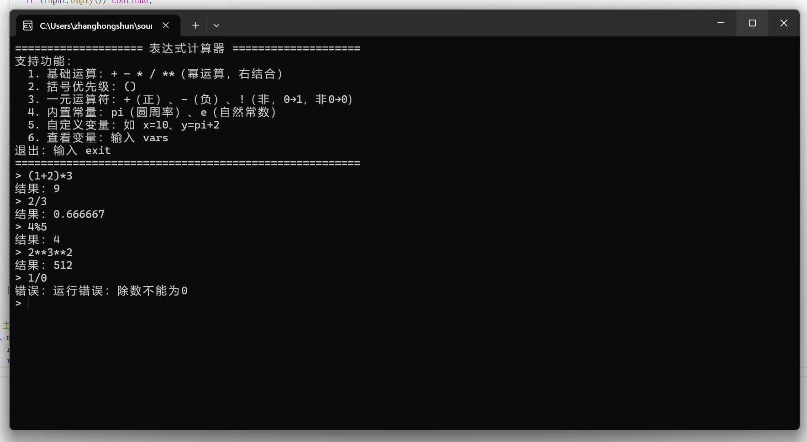

# 计算器01

这是一个用 C++ 实现的**表达式计算器**，支持基础四则运算、括号嵌套、变量定义与赋值等功能的项目。

## 功能特性

- 支持整数、小数的加减乘除运算
- 支持括号嵌套，如 `(1+2)*3`
- 支持变量定义与赋值，如 `x = 5`,以及x+5的运算
- 交互式输入输出，可连续输入表达式
- 完善的错误提示与异常处理

## 开发环境

- 开发工具：Visual Studio 2022
- 编程语言：C++
- 项目类型：控制台应用

## 编译与运行

1. 克隆或下载本仓库到本地
2. 使用 Visual Studio 2022 打开 `calculator.sln` 解决方案文件
3. 点击“生成解决方案”，编译项目
4. 运行生成的可执行文件，即可进入交互式计算器界面

## 运行示例

